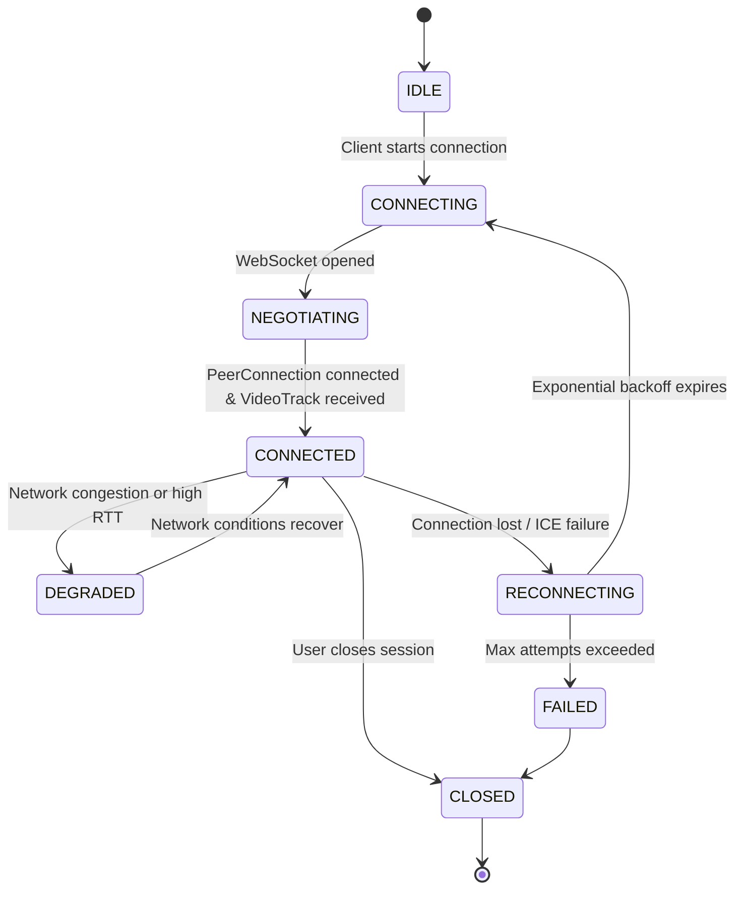

# Flutter Remote — WebRTC V3 Architecture Documentation

## Overview

Flutter Remote enables interactive remote iOS Simulator streaming from GitHub macOS runners directly to modern web browsers with ultra-low latency, robust keyframe recovery, and responsive input.

---

## High-Level Architecture

```text
                               ┌─────────────────────────┐
                               │         Browser         │
                               │                         │
                               │  FlutterRemoteClient    │
                               │ ┌────────┐ ┌─────────┐  │
                               │ │ Video  │ │  Input  │  │
                               │ │Renderer│ │Control  │  │
                               │ └───┬────┘ └────┬────┘  │
                               └─────┼───────────┼───────┘
                                     │           │
                          WebRTC Media (RTP)   WebRTC DataChannels
                                     │     (input/keyboard/control/telemetry)
                                     │           │
                                     ▼           ▼
                               ┌─────────────────────────┐
                               │   WebRTC Peer Bridge    │
                               │     (webrtc-peer)       │
                               │ ┌─────────────────────┐ │
                               │ │ PeerSession         │ │
                               │ │ DataChannelManager  │ │
                               │ │ ServerMetrics       │ │
                               │ └──────────┬──────────┘ │
                               └────────────┼────────────┘
                                            │
                                    localhost HTTP/WS
                                            │
                                            ▼
                               ┌─────────────────────────┐
                               │   iOS Simulator Host    │
                               │      (macOS Runner)     │
                               │                         │
                               │  serve-sim (port 3200)  │
                               │  iOS Simulator instance │
                               └─────────────────────────┘
```

---

## System Planes

### 1. Signaling Plane
* **Transport**: WebSocket on `/signal`.
* **Responsibilities**:
  - WebRTC SDP offer/answer exchange.
  - ICE candidate trickle.
  - Generation ID validation to reject stale signaling messages during reconnection.
* **Invariant**: Signaling NEVER transports high-frequency input events or video frames.

### 2. Media Plane
* **Pipeline**:
  ```text
  serve-sim (MJPEG)
         ↓
  ServeSimConsumer (SOI/EOI demarcation)
         ↓
  FrameController (Bounded Queue, drop oldest on congestion)
         ↓
  VideoEncoder (FFmpeg libx264 zerolatency Annex-B stream)
         ↓
  KeyframeController (SPS/PPS caching & IDR validation)
         ↓
  RtpPacketizer (RFC 6184 FU-A fragmentation & M=1 marker bits)
         ↓
  WebRTC VideoTrack (SendOnly)
  ```
* **Invariants**:
  - **Sequence Numbers**: Strictly incrementing across all packets.
  - **Timestamps**: Progress at standard 90kHz rate; uniform for all packets within the same Access Unit.
  - **Marker Bit**: Set to $M=1$ strictly on the final packet of each Access Unit.
  - **SSRC**: Remains constant for the stream duration.

### 3. Control & Input Plane
* **DataChannels**:
  - `input`: Unreliable and unordered (`{ ordered: false, maxRetransmits: 0 }`). Used for pointer moves, touch, and wheel scrolling.
  - `keyboard`: Reliable and ordered (`{ ordered: true }`). Used for discrete keydown, keyup, and IME composition events.
  - `control`: Reliable and ordered (`{ ordered: true }`). Used for session commands, clipboard paste, and keyframe requests.
  - `telemetry`: Unreliable and unordered (`{ ordered: false, maxRetransmits: 0 }`). Used for low-priority diagnostic reporting.
* **Input Coalescing & Backpressure**:
  - **Pointer Moves**: Coalesced to display refresh rate using `requestAnimationFrame`. If the DataChannel `bufferedAmount > 65536`, move events are dropped.
  - **Button Down/Up**: NEVER dropped, ensuring touch releases and click completions are always registered.
  - **Wheel / Scrolling**: Burst `wheel` events accumulate `deltaX` and `deltaY`. A single combined `scroll` event is dispatched on the next animation frame, reducing message frequency by up to 80%.

---

## Lifecycles

### Session Lifecycle



### Keyframe & IDR Recovery Lifecycle

When a client connects or detects video artifacts, it requests an IDR keyframe:
1. Client sends `{ type: "request_keyframe" }` over the reliable `control` DataChannel.
2. `KeyframeController` coalesces duplicate requests into a single promise.
3. A replacement FFmpeg encoder process is spawned with forced IDR flags (`-forced-idr 1`, `-g 30`).
4. The latest raw JPEG frame is fed to the replacement encoder.
5. The replacement encoder outputs SPS, PPS, and an IDR slice.
6. `KeyframeController` validates that SPS, PPS, and IDR are all present, caches them, updates the reference chain, and seamlessly promotes the replacement encoder to active.
7. Encoded IDR packets are packetized with continuous sequence numbers and dispatched to WebRTC video tracks.

### Reconnect & ICE Restart Lifecycle

```text
Connection Interrupted
         ↓
PeerConnection 'disconnected'
         ↓
Attempt ICE Restart (createOffer with iceRestart: true)
         ↓
Success? ──── YES ───► Resume active stream
   │
   NO
   ▼
Full Reconnection
   - Advance generation ID (e.g. Gen 1 → Gen 2)
   - Exponential backoff: 500ms → 1000ms → 2000ms → 4000ms → 8000ms → 10000ms
   - Re-establish WebSocket signaling
   - Negotiate fresh RTCPeerConnection
   - Stale messages from older generation IDs are ignored
```

---

## Observability & Metrics

### Client-Side Normalized Metrics
Sampled at 1Hz by `WebRTCStatsCollector`:
- **RTT**: Round-trip time in milliseconds from candidate pair.
- **FPS**: Frames per second from inbound RTP.
- **Bitrate**: Calculated from delta bytes received over delta time.
- **Packet Loss Percentage**: Calculated strictly from deltas:
  $$\text{lossRate} = \frac{\Delta\text{packetsLost}}{\Delta\text{packetsLost} + \Delta\text{packetsReceived}}$$
  Display format: `0.32%` (not raw cumulative count).

### Server-Side Metrics
- **Encoder**: FPS, encode latency (ms), encoded frames count, restart count.
- **Frame Pipeline**: Total frames received, dropped frames, queue depth.
- **RTP**: Total packets sent, frames packetized, IDR frames count.
- **System**: Resident memory (RSS MB), heap used (MB), uptime (seconds).
- **Endpoint**: Available via `GET /metrics` in JSON format.
